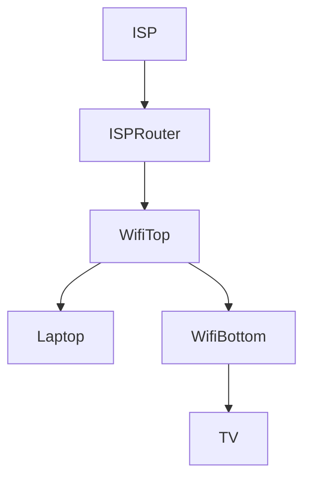
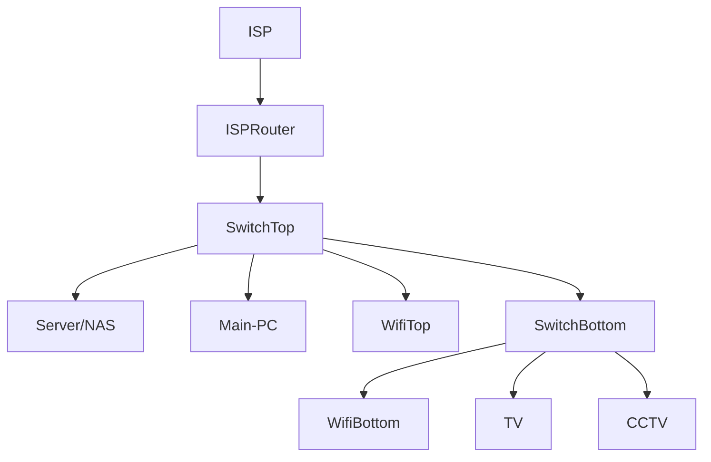
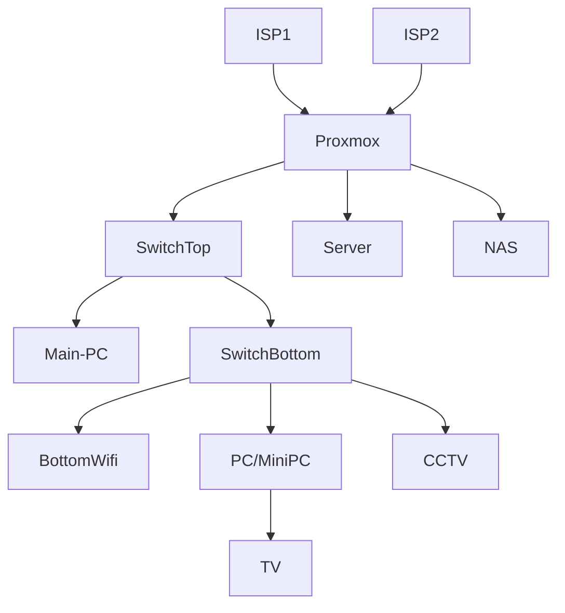

# Current Home Network Configuration

```mermaid
graph TD
  ISP-->ISPRouter
  ISPRouter-->WifiTop
  WifiTop-->Laptop
  WifiTop-->WifiBottom
  WifiBottom-->TV

```

# Planning Future Home Network Configuration

```mermaid
graph TD
  ISP-->ISPRouter
  ISPRouter-->SwitchTop
  SwitchTop-->Server/NAS
  SwitchTop-->Main-PC
  SwitchTop-->WifiTop
  SwitchTop-->SwitchBottom
  SwitchBottom-->WifiBottom
  SwitchBottom-->TV
  SwitchBottom-->CCTV
```

# Future-future Network

```mermaid
graph TD
  ISP1-->Proxmox
  ISP2-->Proxmox
  Proxmox-->SwitchTop
  Proxmox-->Server
  Proxmox-->NAS
  SwitchTop-->Main-PC
  SwitchTop-->SwitchBottom
  SwitchBottom-->BottomWifi
  SwitchBottom-->PC/MiniPC
  SwitchBottom-->CCTV
  PC/MiniPC-->TV
```
